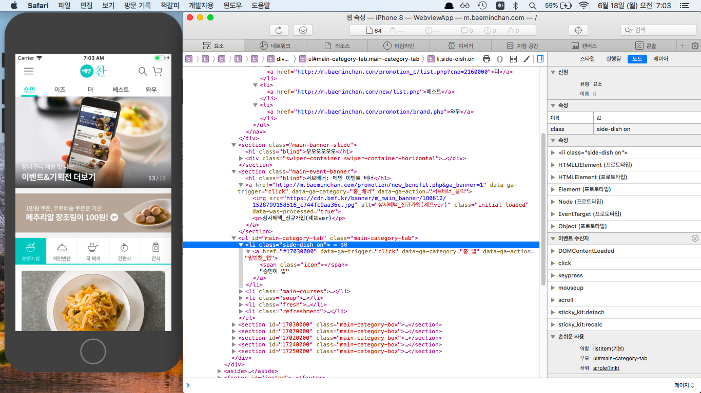

# Web App

## WebKit
</img>

### WKWebView 추가
- !! 별 거 하지도 않았는데.. 다음 에러가 떠서 하얀화면만 나옴
- 해결: 아래 3개 메소드는 구현해줘야 함

```swift
func webView(_ webView: WKWebView, decidePolicyFor navigationAction: WKNavigationAction, decisionHandler: @escaping (WKNavigationActionPolicy) -> Void) {
	decisionHandler(.allow)
}

func webView(_ webView: WKWebView, decidePolicyFor navigationResponse: WKNavigationResponse, decisionHandler: @escaping (WKNavigationResponsePolicy) -> Void) {
	decisionHandler(.allow)
}

func webView(_ webView: WKWebView, didReceive challenge: URLAuthenticationChallenge, completionHandler: @escaping (URLSession.AuthChallengeDisposition, URLCredential?) -> Void) {
	completionHandler(.performDefaultHandling, nil)
}
```

### 웹에서 사이트 로딩 과정 디버깅
- Safari > Develop > Simulator 메뉴 활용
- 일부 요소값 변경해 봄

</img>

### 학습 내용
>- **[WKNavigationDelegate]()**
>- **[WebKitView vs. WebView]()**


<br/>
