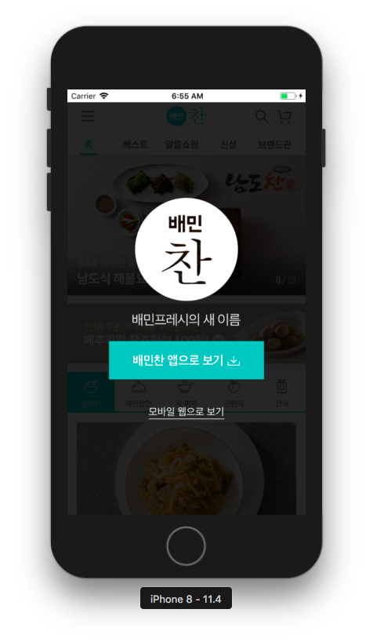

# Web App

## WebKit

</img>

### WKWebView 추가
- !! 별 거 하지도 않았는데.. 다음 에러가 떠서 하얀화면만 나옴
- 해결: 아래 3개 메소드는 구현해줘야 함

```swift
func webView(_ webView: WKWebView, decidePolicyFor navigationAction: WKNavigationAction, decisionHandler: @escaping (WKNavigationActionPolicy) -> Void) {
	decisionHandler(.allow)
}

func webView(_ webView: WKWebView, decidePolicyFor navigationResponse: WKNavigationResponse, decisionHandler: @escaping (WKNavigationResponsePolicy) -> Void) {
	decisionHandler(.allow)
}

func webView(_ webView: WKWebView, didReceive challenge: URLAuthenticationChallenge, completionHandler: @escaping (URLSession.AuthChallengeDisposition, URLCredential?) -> Void) {
	completionHandler(.performDefaultHandling, nil)
}
```

### 웹에서 사이트 로딩 과정 디버깅
- Safari > Develop > Simulator 메뉴 활용
- 일부 요소값 변경해 봄

</img>

### 학습 내용
>- **[WebKitView vs. WebView]()**
>- **[WKWebview 사용 시 사파리 디버깅 과정]()**
>- **[웹로딩 액션으로 할 수 있는 내용들: WKNavigationDelegate]()**


<br/>

## 커스텀 페이지 로딩

</img>

### 앱에서만 팝업 제거하여 커스텀 로딩
- WKUserScript 유저 스크립트 클래스 활용: 자바스크립트 구현
- **단, 스크립트 생성 시 injectionTime을 페이지 로딩 후(.atDocumentEnd)로, forMainFrameOnly는 false로 지정해야 적용된다****.**

```swift
override func loadView() {
    super.loadView()
    let config = WKWebViewConfiguration()
    config.userContentController = WKUserContentController()
    let script = WKUserScript(source: Constant.js, injectionTime: .atDocumentEnd, forMainFrameOnly: false)
    config.userContentController.addUserScript(script)
    webView = WKWebView(frame: .zero, configuration: config)
    self.view.addSubview(webView)
}
```

### 학습 내용
>- **[JS 코드를 인젝션하는 방법]()**
>- **[JSCore로 웹 페이지 자바스크립트와 바인딩하는 방법]()**

<br/>

## 사파리 뷰컨트롤러로 검색 페이지 로딩

</img>

### 검색 버튼 클릭 시, 사파리 뷰컨트롤러로 페이지 로딩
- 링크 이벤트 발생 시 사파리 컨트롤러를 present 하도록 `webView(_ webView: WKWebView, decidePolicyFor navigationAction: WKNavigationAction, decisionHandler: @escaping (WKNavigationActionPolicy) -> Void)` 내부에 구현
- 이 때, navigation은 cancel한다.
- 사파리 뷰컨트롤러의 '닫기' 선택 시 창을 닫을 수 있도록 SFSafariViewControllerDelegate의 func safariViewControllerDidFinish(_ controller: SFSafariViewController) 에서 dismiss 하였다.

```swift
func webView(_ webView: WKWebView, decidePolicyFor navigationAction: WKNavigationAction, decisionHandler: @escaping (WKNavigationActionPolicy) -> Void) {

    if navigationAction.navigationType == .linkActivated, let url = navigationAction.request.url {
        decisionHandler(.cancel)
        switch url.path {
        case RequestPath.search.rawValue: presentSafariViewController(url)
        default: break
        }
    } else {
        decisionHandler(.allow)
    }

}

extension ViewController: SFSafariViewControllerDelegate {
    func safariViewControllerDidFinish(_ controller: SFSafariViewController) {
        self.dismiss(animated: true, completion: nil)
    }
}
```

### 상단 메뉴 클릭 시, 하위 노드들의 정보 출력
- '.slide-navi' 속성을 가진 메뉴 클릭 시, 하위 노드들의 텍스트 및 링크 정보를 json으로 보내도록 자바스크립트 추가
- WKScriptMessageHandler의 func userContentController(_ userContentController: WKUserContentController, didReceive message: WKScriptMessage)에서 받은 메시지를 json으로 변환하여 출력

</img>

### 학습 내용
>- **[사파리 뷰컨트롤러 동작 및 사파리와 공유하는 내용]()**